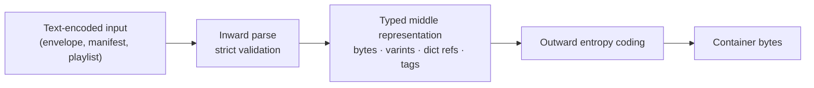
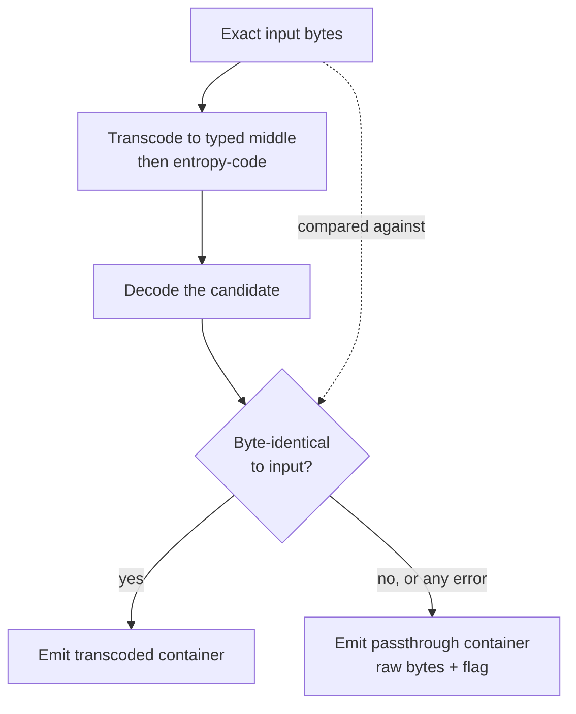

# Middle-Out: WokeNet's Compression Program

## Document status

- **Design status:** Specified. This document is the normative description of
  what middle-out is and what it is allowed to claim.
- **Implementation status:** `packages/middle-out` is the only implementation
  surface. Whichever subset exists is defined by that package's committed
  source and tests, never by this document. Nothing here should be read as
  evidence that any described component runs.
- **Measurement status:** **This document contains no measurements.** Every
  number that describes codec performance lives in
  `packages/middle-out/BENCHMARK.md`, which is generated by the benchmark
  harness. If that file is absent, stale, or hand-edited, there is no measured
  claim and none may be repeated.
- **Last updated:** 2026-07-30
- **Decision record:**
  [ADR-0001](DECISIONS/0001-middle-out-compression-program.md)

## What middle-out is

Middle-out is a two-layer compression program, not a single algorithm.

**Layer 1 — content-defined chunking and global dedup.** Split byte streams at
boundaries chosen by a rolling hash over the content itself, address each chunk
by its digest, and store each unique chunk once for the whole network. The win
is that identical bytes are never paid for twice: not across re-uploads, not
across mirrors, not across edits of the same source.

**Layer 2 — typed middle-representation transcoding.** Parse *inward* from a
text encoding to a typed middle representation (raw bytes, varints, dictionary
references, structural tags), then entropy-code *outward* from that middle
representation. The target is encoded randomness: a base58 public key, a
base64url digest, a base32 CID — high-entropy bytes wearing an ASCII costume.
Recovering the underlying bytes is not a better statistical model; it is undoing
a known transformation, which is why it is deterministic and why it reaches the
information floor exactly rather than approaching it. It is *not* true that a
general-purpose compressor cannot recover the alphabet expansion — see
[the base-N caveat](#what-an-entropy-coder-already-recovers) — so the size
margin on the base-N forms alone is small. The margin worth having is on the
forms that carry structure as well as entropy.

The name describes the shape of the pipeline: you go in to the middle, then
back out.



## What middle-out is not

This section is load-bearing. It exists so that no reader, internal or
external, can mistake the program for something it is not.

- **It is not a pixel codec, and it makes no claim against AV1, HEVC, AVC, or
  VVC.** Middle-out does not encode pixels, motion vectors, or residuals. It
  never competes with a video codec, and any comparison to one is a category
  error. Renditions are produced by ordinary, established video encoders.
- **It is not a general-purpose compressor.** Layer 2 works by knowing the
  input grammar. Given bytes whose grammar it does not know, it must fall back
  to passthrough (see [Losslessness](#losslessness-is-structural)) and its
  ratio is ~1.0 by construction.
- **It is not a claim that decentralized storage uses fewer total bytes than a
  centralized service.** A network with replication factor *k* stores *k*
  copies. Whether dedup outruns replication is an arithmetic question about
  real corpora and real replication policy, and it has not been answered here.
- **No efficiency claim is valid without a public corpus and a reproducible
  score.** Not in this repository, not in a README, not in a talk, not in a
  post. The rule is absolute and is the substance of ADR-0001.

## Layer 1 — content-defined chunking and global dedup

### The mechanism

Fixed-size blocking fails under insertion and deletion. Insert one byte at the
front of a file split into 4 KiB blocks and every subsequent block boundary
shifts by one byte, so every block digest changes and dedup against the
previous version recovers nothing. This is the boundary-shift problem, and for
media it is the common case: creators re-cut intros, replace sponsor reads,
fix an audio bed, and re-publish.

Content-defined chunking (CDC) removes the dependence on absolute offsets. A
rolling hash slides a fixed window across the stream; a boundary is declared
wherever the hash satisfies a cut condition. Because the condition depends only
on the window's contents, an edit perturbs the chunks it touches and the
boundaries re-synchronize shortly afterward. Minimum and maximum chunk-size
clamps bound the tail of the size distribution, and normalized chunking (the
FastCDC family) tightens variance by varying the cut mask near the target size.

The normative parameters — window function, mask width, min/target/max sizes,
normalization level — belong to `packages/middle-out` and its tests, because
changing them changes every chunk boundary and therefore every chunk address.
They are protocol-visible constants, not tuning knobs.

### Where the dedup win is real, and where it is not

The single most common way to lie about dedup is to imply that renditions
deduplicate against each other. They do not: a 1080p and a 720p encode of the
same source share no pixel bytes. Here is the honest accounting.

| Scenario | Bytes genuinely identical? | Layer-1 effect |
| --- | --- | --- |
| The same file uploaded by many accounts | Yes, exactly | Full win: stored once for the network. The dominant real-world case for viral media. |
| Mirrors and re-pins of an existing object | Yes, exactly | Lowers total *unique* bytes; does not lower the replica count, which is a policy knob |
| Re-publish after trimming an intro or swapping a sponsor read | Mostly, with a local perturbation | The CDC win. Fixed blocking recovers ~nothing here; CDC recovers the unchanged body |
| Two renditions of one source (1080p vs 720p) | **No** | **None.** Different pixel bytes. Claiming otherwise is dishonest |
| One audio rendition referenced by every video rendition | Yes, if the ladder muxes audio separately | Real, and it is an encode-pipeline decision, not a compression result |
| Initialization/header segments repeated across a rendition | Yes | Small, free |
| Re-encode of an unchanged source with identical parameters | Only if the encoder is bit-deterministic | **Hypothesis.** Requires proving bit-identical output before it may be counted |
| Slates, black frames, and static segments inside one video | Often yes | Real, corpus-dependent |

Two consequences follow, and both are stated in the video design:

1. Dedup gains are a property of a corpus, not of a codec. A corpus with no
   duplication shows no Layer-1 win, and that result must be published with the
   same prominence as a favourable one.
2. Chunk sharing puts dedup in tension with deletion. A chunk referenced by two
   manifests cannot be removed by unpinning one of them. See
   [VIDEO.md](VIDEO.md#dedup-and-deletion-are-in-tension).

### Costs that must be measured, not assumed

- **Chunk-count overhead.** Every chunk costs an index entry, a manifest entry,
  and potentially a request. Smaller chunks dedup better and cost more. The
  crossover is a measurement.
- **Request amplification.** Fetching a video as many small chunks can be
  slower than fetching a few large segments even when it transfers fewer bytes.
  Bytes saved is not the same as time saved.
- **Privacy.** Convergent addressing lets anyone who has a candidate file
  confirm its presence by computing its chunk digests. CDC with a public
  boundary function is appropriate for public media and inappropriate for
  private content, which needs a keyed boundary function or no dedup at all.

## Layer 2 — typed middle-representation transcoding

### Why generic compressors lose here

WokeNet's protocol surface is dense with text-encoded randomness. Solana public
keys and PDAs arrive as canonical base58. JSON digests arrive as multibase
base64url with a `u` prefix. Content identifiers arrive as 59-character
base32-lowercase CIDv1 strings. Identity URIs concatenate a fixed scheme, a
deployment pair, and a PDA into 160-odd characters. Byte lengths arrive as
decimal strings. Timestamps arrive as RFC 3339 with exact millisecond
precision.

Across records a compressor does find the repeated literals — the scheme prefix,
the deployment identifier, the field names — and it finds them well.

### What an entropy coder already recovers

The obvious next sentence is that it cannot recover the ~2.7 bits per character
a base58 alphabet wastes on a random 32-byte value. **That sentence is false and
must not be written here.** gzip and brotli are not pure LZ: each has a Huffman
stage over literals, and a base58 string is a near-uniform stream over 58
symbols, which Huffman prices near log2(58) = 5.86 bits per character rather
than 8. brotli's context modelling gets closer still. Measured on a corpus of
nothing but base58 keys, brotli -q11 lands within a few percent of the
32-bytes-per-key floor on its own; the same holds for base64url digests and
base32 CIDs. `packages/middle-out/test/adversarial.test.ts` measures this and
annotates the byte counts.

What parsing inward actually buys, stated so it can be checked:

1. **The floor, deterministically.** A typed token carries exactly 32 bytes for
   a 32-byte value, on every input, with no dependence on how uniform the
   alphabet happened to look. An entropy coder approaches the floor and the gap
   varies with the corpus. On the base-N forms this is worth a low single-digit
   percentage, not a factor.
2. **Structure a statistical model has no reason to find.** An
   exact-millisecond timestamp is 24 characters carrying one integer; a
   decimal-string counter is a decimal rendering of a small integer; a composite
   identifier is a shared prefix plus typed tails. These collapse to a varint, a
   varint, and a dictionary reference. This is where the margin is large, and it
   is where the measured wins in `BENCHMARK.md` come from.

Any claim beyond those two is not supported by the harness and should be treated
as marketing.

### Field-level arithmetic ceilings

The table below is **arithmetic, not measurement.** Each row states how many
bytes a text encoding occupies and how many bytes of information it carries, so
a reader can verify the ratio by hand. These are per-field ceilings for the
value alone; they say nothing about a whole document, which additionally pays
for structural tags, field ordering, and container framing, and which is only
knowable by running the harness.

| Field | Canonical text form | Text bytes | Information carried | Typed bytes | Ceiling ratio |
| --- | --- | --- | --- | --- | --- |
| Solana public key / PDA | base58, 44 chars typical | 44 | 32-byte key | 32 | 0.727 |
| Digest in JSON | `u` + base64url(32), unpadded | 44 | 32-byte digest | 32 | 0.727 |
| Ed25519 signature | `u` + base64url(64), unpadded | 87 | 64-byte signature | 64 | 0.736 |
| Random nonce | `u` + base64url(16), unpadded | 23 | 16 random bytes | 16 | 0.696 |
| CIDv1 raw + sha2-256 | `b` + base32lower(36), unpadded | 59 | 4 prefix bytes + 32-byte digest | 32 + tag | ~0.56 |
| Composite identity URI | scheme + `wokenet:v1` + genesis + program + PDA | ~161 | 32-byte PDA + deployment ref | ~34 | ~0.21 |
| Byte length as a decimal string | `"248193"` | 6 | integer < 2^21 | 3 (varint) | 0.500 |
| Exact-millisecond ISO timestamp | `2026-07-30T12:34:56.789Z` | 24 | ms since epoch | 6 (varint) | 0.250 |

Derivations for the rows that are not immediate:

- **base58 length.** `log2(58) ≈ 5.858`, so 256 bits need
  `ceil(256 / 5.858) = 44` characters unless the leading value happens to be
  small enough to fit in 43. Encoding 20,000 SHA-256 digests yields 43
  characters 5.7% of the time and 44 characters 94.3% of the time, which is why
  the table says "44 typical" rather than "44".
- **CIDv1.** A CIDv1 with the `raw` multicodec and a SHA-256 multihash is
  `0x01 0x55 0x12 0x20` followed by 32 digest bytes: 36 bytes. Unpadded base32
  of 36 bytes is `ceil(36 × 8 / 5) = 58` characters, plus the multibase `b`,
  giving the 59-character canonical form. Inward, the four prefix bytes are one
  structural tag and only the digest is per-record entropy.
- **Composite identity URI.** `wokesocialid:v1:` (16) + `wokenet:v1:` (11) +
  three base58 values with separators (44 + 1 + 44 + 1 + 44 = 134) ≈ 161 bytes.
  Two of those three values are per-deployment constants, so after the first
  occurrence they are dictionary references; only the identity PDA is
  per-record entropy.

**The honest reading of that last row.** The ~0.21 ceiling is not the margin
over gzip or brotli. Those compressors already back-reference the repeated
scheme prefix and the repeated deployment pair within their window; brotli's
window is large and its static dictionary helps further. The margin that
middle-out can actually claim over them is concentrated in the *random* fields —
the 44→32 on each key, the 59→33 on each CID, the 24→6 on each timestamp — plus
avoiding per-record framing overhead. Anyone quoting a field ceiling as a
compression result is misreading this table.

### Where Layer 2 applies

| Surface | Content | Why it matters |
| --- | --- | --- |
| On-chain references | Locators, CIDs, digests, identity references | Account bytes cost rent and instruction bytes cost fees; the locator budget is small and fixed |
| Indexer projection state | Millions of denormalized records, each carrying identity and object references | Storage and replication cost of every replaceable indexer |
| Relay frames | Small, frequent, latency-sensitive envelopes | Per-frame bytes on the wire; also the worst case for LZ, since each frame is too small for a window to warm up |
| Media manifests / playlists | Rendition lists, segment CID lists, caption tracks, thumbnails | Fetched on every view, before the first frame renders; directly on the critical path |
| Media segments | Encoded audio/video bytes | **Layer 1 only.** Already-compressed bytes; Layer 2 must pass them through |

The last row is the boundary between the two layers. Segments are handled by
chunking and dedup and by nothing else. Attempting to entropy-code an AV1
segment is how a codec loses to `cp`.

## Losslessness is structural

Middle-out cannot corrupt data even if the transcoder is wrong, because the
encoder does not trust itself.

**The rule.** At encode time, after producing candidate output, the encoder
decodes its own candidate and compares the result byte-for-byte against the
exact input. On any mismatch — and on any thrown error anywhere in the
transcode path — the encoder discards the candidate and emits a passthrough
container holding the raw input bytes behind a mode flag.



**Why this is a guarantee and not a hope.** A transcoder bug can only ever cost
compression ratio, never fidelity, because a bug's output is exactly what the
round-trip gate rejects. The trusted surface shrinks from "the whole
transcoder" to two primitives: the container framing and the byte comparison.
Those are small, total, and directly testable, which is the entire point — a
young transcoder becomes safe to deploy the moment the gate exists.

**What it does not prove.**

- It does not prove the encoder is *good*. A transcoder that fails every
  round-trip is perfectly lossless and perfectly useless. This is why the
  passthrough rate must be published alongside every ratio; a ratio without it
  is uninterpretable.
- It does not protect against a **decoder that changes meaning between
  versions.** A gate run by today's decoder says nothing about tomorrow's.
  Mitigation: a format version in the container, plus committed golden vectors
  that pin historical bytes to their expected decode, so a future decoder
  change that would reinterpret old data fails a test instead of a user.
- It requires **deterministic encoding.** A non-deterministic encoder can pass
  the gate on one run and produce different bytes on the next. Library code
  therefore uses no clock and no randomness.
- It does not cover the transport. Bytes damaged after encoding are a
  storage-and-integrity concern, answered by content addressing, not by this
  gate.

**Cost.** Encoding does the decode work too, so encode wall time is roughly
doubled and includes a full-length comparison. Decode is unaffected. For a
write-once, read-many media network this is close to the cheapest possible
place to spend the safety budget, but it is a real cost and it belongs in the
benchmark's timing columns rather than in a footnote.

## The measurement contract

No claim about middle-out's efficiency exists until the harness produces it.
This section defines what the harness must do for a number to count.

### Corpus

- **Committed and public.** The corpus lives in the repository, not on a
  developer's disk. A score references the corpus by commit and by digest.
- **Deterministic.** Synthetic families are generated from fixed seeds. No
  `Math.random`, no `Date.now`, no network fetch at benchmark time. Two runs on
  the same commit must produce the same corpus bytes.
- **Family-separated.** Results are reported per family, never as a single
  blended headline, because a blended number can be moved arbitrarily by
  changing the family mix.
- **Adversarial by construction.** The corpus must include the cases that make
  the codec look bad: already-compressed bytes, encrypted bytes, empty input,
  single-byte input, inputs just below and just above every internal threshold,
  and syntactically valid inputs the transcoder does not understand. A corpus
  that only contains favourable families is a marketing asset, not evidence.
- **No unlicensed material.** Real captured samples appear only where licensing
  permits redistribution.

### Baselines

| Baseline | Configuration | Role |
| --- | --- | --- |
| Raw | No compression | Denominator for every ratio |
| gzip level 9 | `node:zlib`, maximum level | Reference codec for the Weissman score |
| brotli quality 11 | `node:zlib`, maximum quality, with the size hint set | Strongest cheap general-purpose baseline |
| zstd, maximum level | `node:zlib`, **only if** the pinned Node exposes it | Additional baseline where available |

The harness records the exact Node version and the exact list of baselines it
actually ran. If a stronger general-purpose codec was not run, the report says
so, and the result must never be described as beating "general-purpose
compression" in the abstract — only as beating the baselines named in the
report.

### Weissman score

The score is reported per family as:

```text
W = alpha × (r_middleout / r_reference) × (ln T_reference / ln T_middleout)
```

- `r_c` = uncompressed bytes ÷ compressed bytes for codec `c` on the family.
- `T_c` = total compression wall-clock time for codec `c` on the family, **in
  seconds**.
- Reference codec: **gzip level 9**.
- Declared **alpha = 1.0**, so the score is a pure relative quantity.

Four honesty conditions travel with every score:

1. **Alpha is a free constant.** A Weissman score without a declared alpha and
   a declared reference codec is not a number, it is a mood. Ours are declared
   above and must be restated wherever the score is quoted.
2. **The log term is unit-sensitive and sign-flipping.** `ln T` is negative for
   `T < 1 s`, which can invert the ratio term's meaning. The harness therefore
   **refuses to report a score** for any family where either codec's total time
   is at or below one second, and reports raw ratio and raw time instead.
3. **It is comparable only inside our harness**, on the recorded machine,
   against the recorded corpus commit. It is not comparable to any score
   published by anyone else.
4. **It omits decode.** Decode throughput is reported separately and matters
   more than encode for a read-heavy media network. The score is never the only
   number in a summary.

### Verification requirement

- Every corpus item must round-trip byte-exact through encode then decode. The
  harness compares bytes itself; it does not trust the encoder's own gate.
- Any round-trip failure is a **hard harness failure**. It does not produce a
  lower score; it produces no score.
- **Passthrough rate is a required output column**, per family. A high ratio
  next to a high passthrough rate means the corpus was easy, not that the codec
  was good.
- Determinism is checked: encoding the same input twice must produce identical
  bytes.

### Required report fields

`packages/middle-out/BENCHMARK.md` is generated, never hand-edited, and
contains at minimum: the exact command, the Node version, OS and architecture,
CPU model, the corpus commit and digest, the list of baselines actually run,
and per family — item count, raw bytes, compressed bytes and wall time for each
codec, ratio, passthrough count, decode time, and the Weissman score or the
explicit reason it was withheld.

### Reproduce command

```bash
pnpm --filter @wokenet/middle-out bench
```

If that command does not run, or if `BENCHMARK.md` does not exist, then there
is no measured claim to discuss.

## Roadmap: candidate improvements

Everything in this section is a **hypothesis**. None of it is implemented,
none of it is measured, and none of it may be described as a benefit until the
harness says so. Each entry names what would falsify it, because a hypothesis
that cannot fail is not engineering.

| Candidate | Hypothesis | How it would be measured | What would falsify it |
| --- | --- | --- | --- |
| **Dictionary training** | A shared static dictionary of deployment prefixes, program IDs, MIME types, and codec strings cuts small-payload overhead where per-message windows never warm up | Ratio on the small-frame families, with and without the dictionary | No material gain on small frames, or the gain does not survive the dictionary's own versioning cost |
| **Delta-encoded playlists** | A live playlist refresh differs from its predecessor by an appended segment, so sending the delta beats sending the document | Bytes per refresh over a simulated live window | Deltas cost more than a re-transcoded document once base-version tracking is included |
| **Seek-aware segment ordering** | Laying out chunks so that a seek maps to contiguous ranges lowers seek latency | Seek latency percentiles, **not** bytes | Latency does not improve, or the layout constraint measurably worsens dedup |
| **Hardware-aware encode ladders** | Pinning encoder parameters per hardware class yields bit-identical output for identical input, enabling dedup across independent re-encodes | Byte-identity rate across repeated encodes on the same and different hardware | Output is not bit-identical, which would make the whole cross-encode dedup claim inadmissible |
| **Transport framing** | Grouping many small typed records into one entropy-coded frame lets the model amortize | Bytes per record versus record count per frame | Amortization is swallowed by added latency or by head-of-line blocking |
| **CDC parameter search** | Better min/target/max and normalization values improve dedup ratio at acceptable chunk-count cost | Dedup ratio versus chunk count on the edit-and-re-upload families | Improvements are corpus-specific and do not hold on held-out data |
| **Caption and subtitle transcoding** | Cue timings and text are separable, and timings delta-encode well | Ratio on a caption family | Caption bytes are dominated by natural-language text, which brotli already handles well |
| **Thumbnail sprite dedup** | Sprite sheets across renditions share tiles | Unique-tile ratio on a thumbnail family | Sprites are re-encoded per rendition and share no bytes |

A candidate is promoted out of this table by one thing only: a committed
harness result on a public corpus, reproducible by the command above.

## Related documents

- [VIDEO.md](VIDEO.md) — the decentralized video platform this program serves.
- [DECENTRALIZED_SOVEREIGNTY.md](DECENTRALIZED_SOVEREIGNTY.md) — the ideology
  and the build order, whose third gate is "prove the efficiency moat."
- [ADR-0001](DECISIONS/0001-middle-out-compression-program.md) — the decision to
  run middle-out as a measured program.
- `packages/middle-out/BENCHMARK.md` — the only place measurements live.
- The WokeSocial repository's `docs/PROTOCOL.md` — the canonical serialization,
  identifier encodings, and content-addressing rules that Layer 2 parses.
