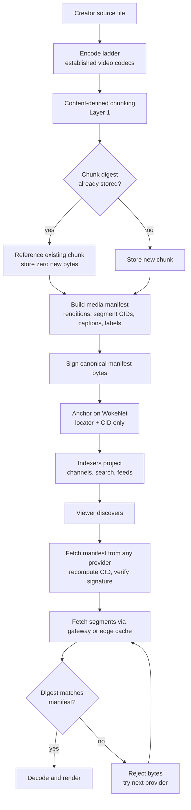

# WokeNet Video: A Decentralized Video Platform

## Document status

- **Design status:** Specification of intent. This document defines the
  architecture, the playback contract, and the content policy for a
  decentralized video platform built on WokeNet.
- **Implementation status:** **Nothing in this document is built.** There is no
  transcode pipeline, no storage network, no gateway, no player, no moderation
  tooling, no age assurance, and no on-chain media manifest ABI. The complete
  gate list is in [Not built yet](#not-built-yet).
- **Measurement status:** No playback or efficiency number in this document is
  measured, and none is asserted. Metrics are *defined* here so they can later
  be measured; codec measurements live only in
  `packages/middle-out/BENCHMARK.md`.
- **Policy status:** The content policy below is a design position that requires
  qualified legal review per jurisdiction before any adult surface exists. It is
  not a published terms-of-service document.
- **Last updated:** 2026-07-30
- **Related:** [MIDDLE_OUT.md](MIDDLE_OUT.md),
  [DECENTRALIZED_SOVEREIGNTY.md](DECENTRALIZED_SOVEREIGNTY.md),
  [ADR-0001](DECISIONS/0001-middle-out-compression-program.md)

## What this is

A video platform with YouTube's shape — upload, discover, watch, subscribe —
where the video bytes live in content-addressed storage operated by many
parties, the protocol carries only compact signed references, and the player
verifies every byte it renders. The publisher owns the object. The operator is
replaceable. The viewer can check the work.

The efficiency argument that makes it economically plausible is
[middle-out](MIDDLE_OUT.md): Layer 1 dedup means the network stores unique
bytes rather than uploads, and Layer 2 means the reference and manifest traffic
around the media is small.

## Goals

Each goal is paired with how it would be *tested*, because a goal that cannot
fail is a slogan.

| Goal | What it concretely requires | How it is tested |
| --- | --- | --- |
| **Fully decentralized** | No component whose disappearance stops playback: replaceable storage providers, replaceable gateways, replaceable indexers, client-side verification | Kill the flagship gateway and indexer in a test topology; a stock client with only public configuration still plays a published video |
| **Extremely fast** | Time to first frame, seek latency, and rebuffer ratio competitive with a centralized CDN | The metrics defined in [Playback](#what-fast-means) measured on declared device classes, network profiles, and cache states |
| **High quality** | Standard modern encode ladders using established video codecs; no quality sacrifice attributable to the network | Objective quality metrics per rendition against the source, plus a bitrate ladder published per profile |
| **Environment-friendly** | Fewer stored bytes via dedup, fewer transferred bytes via edge caching, no redundant re-transcode of identical inputs | Unique-bytes-stored per published minute, and bytes transferred per minute watched — with the replication counterweight in [Sustainability](#sustainability-mechanism-not-slogan) |
| **Free to publish and watch** | A funded pinning and egress layer, since "free to the user" only moves the cost | Not testable until the funding model exists; until then the platform is not described as free |
| **Accepting and non-judgemental** | No moral policing of lawful consensual adult expression; labels that inform rather than punish | Policy review plus enforcement audits showing that maturity labels do not reduce reach inside opted-in surfaces |
| **NSFW-tolerant, safely** | Adult content permitted, labelled, opt-in, age-assured — and rigorously separated from the absolute prohibitions | The controls and prohibitions in [Content policy](#content-policy-adult-content-and-absolute-prohibitions) |

### Non-goals

- Beating AV1/HEVC/AVC at pixel coding. Renditions are produced by established
  encoders. See [MIDDLE_OUT.md](MIDDLE_OUT.md#what-middle-out-is-not).
- Putting video bytes on a blockchain. The chain carries references and
  nothing else.
- Guaranteeing global erasure of published bytes. See
  [Deletion semantics](#deletion-semantics-and-honest-permanence).
- Being unmoderated. Decentralization is about who can be shut off, not about
  whether abuse of a person is allowed.

## Architecture

### Layers

| Layer | Holds | Authority | Replaceable? |
| --- | --- | --- | --- |
| WokeNet program (Solana) | Publisher identity references, manifest locator + CID, tombstones | Finalized on-chain state | No — it is the anchor |
| Signed media manifest | Renditions, segment CIDs, captions, thumbnails, labels, provenance | Valid signature by an authorized key, over canonical bytes | The bytes live anywhere; the object is portable |
| Content-addressed storage | Chunks and segments, addressed by digest | The digest. A provider is never an authority | Yes |
| Gateways / edge caches | Cached bytes near viewers | None. A cache cannot lie without being detected | Yes |
| Indexers | Search, channels, recommendations, watch state projections | None. Projections carry provenance and are rebuildable | Yes |
| Player | Verification, ABR, prefetch, rendering | The viewer's device | Yes — any conforming client |

No arrow to a hosted service implies authority. This mirrors the WokeSocial
architecture's authority model and provider-replaceability decision.

### The signed media manifest

The manifest is the portable object that *is* the video. It is a signed
envelope over canonical bytes, so it can be mirrored, archived, handed to
another client, or re-hosted without losing its authenticity.

The sketch below is **planned schema, not accepted by the current
portable-payload union.** The normative schema is a gate, not a fact.

```json
{
  "type": "video",
  "sourceDigest": "u<base64url-sha256-of-the-exact-source-bytes>",
  "durationMs": 742318,
  "renditions": [
    {
      "role": "video",
      "codec": "av01.0.08M.08",
      "width": 1920,
      "height": 1080,
      "frameRateNum": 30000,
      "frameRateDen": 1001,
      "avgBitrateBps": 4200000,
      "initSegmentCid": "bafkrei...",
      "segments": [{ "cid": "bafkrei...", "byteLength": "1048071", "durationMs": 4000 }]
    },
    {
      "role": "audio",
      "codec": "opus",
      "channels": 2,
      "sampleRateHz": 48000,
      "initSegmentCid": "bafkrei...",
      "segments": [{ "cid": "bafkrei...", "byteLength": "64213", "durationMs": 4000 }]
    }
  ],
  "segmentIndex": { "targetDurationMs": 4000, "keyframeAligned": true },
  "captions": [{ "lang": "en", "kind": "captions", "cid": "bafkrei...", "authored": true }],
  "thumbnails": { "posterCid": "bafkrei...", "spriteCid": "bafkrei..." },
  "labels": { "maturity": "adult", "synthetic": "none" },
  "consent": { "depictedAdultsConsented": true, "recordsHeldBy": "publisher" },
  "provenance": {
    "encodeProfile": "wokenet-video-v1",
    "encoder": "self",
    "deterministicParameters": true,
    "captureAttestation": null
  },
  "storagePolicy": { "class": "deletion-compatible", "permanentStorageConsent": false }
}
```

Design rules the schema must satisfy:

1. **Every referenced byte range is independently addressed and independently
   bounded.** A segment CID plus a byte length means a client can reject an
   oversized or truncated response before hashing it.
2. **Audio is its own rendition**, referenced by every video rendition, so a
   ladder stores one audio track rather than one per resolution. This is a real
   Layer-1 win and it is an encode-pipeline decision, not a codec result.
3. **Renditions are keyframe-aligned on a common segment grid**, or ABR
   switching cannot happen without a stall.
4. **Labels are part of the signed object.** A maturity or synthetic-media
   label travels with the video to every client, including clients we do not
   operate. Third-party moderation labels are separate, issuer-attributed
   assertions that do not modify the author's object.
5. **Provenance is a hint, never proof.** A capture attestation raises
   confidence; its absence is not evidence of manipulation.

### What the chain carries, and never carries

WokeNet carries, per published video: the publisher's identity reference, the
manifest locator (bounded to a small ASCII budget), the manifest CID, and the
ability to publish a tombstone. That is the whole footprint.

WokeNet never carries video bytes, segment lists, captions, thumbnails,
watch history, or viewer identity. This is not a capacity workaround; it is the
authority boundary. Bytes belong in storage that can be replaced, and
references belong where they cannot be quietly rewritten.

This is also where [Layer 2](MIDDLE_OUT.md#layer-2--typed-middle-representation-transcoding)
pays directly: the locator and CID are the exact text-encoded-randomness fields
whose byte cost is rent and fees.

### Verification is the client's job

A gateway or provider is a convenience, not a source of truth. Every client:

1. fetches manifest bytes from any provider, enforces a size bound, recomputes
   the CID, then verifies the signature and the signer's key authorization;
2. fetches each segment, enforces the manifest's byte length, recomputes the
   digest, and **only then** hands bytes to the decoder;
3. on any mismatch, discards the bytes, records the provider failure, and tries
   the next configured provider;
4. never treats a successful HTTP response, a provider receipt, or a signed
   gateway header as integrity evidence.

The open tradeoff: verifying a whole segment before playback adds latency
proportional to segment size. Verifying at sub-segment chunk granularity lowers
that latency and raises per-chunk overhead. Which granularity wins is a
measurement, and it is listed as a gate.

### Publish-to-play flow



## Playback

### Adaptive bitrate over content-addressed segments

ABR here differs from URL-based ABR in one useful way: there is no server-side
session. Every rendition's every segment is a content address, so switching
quality is a local decision about which CID to fetch next. Any provider that
has the bytes can serve them, and the client's estimate of throughput is not
entangled with a particular host's session state.

The rendition selector uses measured throughput and buffer occupancy, with a
conservative first choice because time to first frame dominates the perceived
experience. Because segments are keyframe-aligned on a common grid, a switch
takes effect at the next segment boundary without a decoder reset.

### Seek

Seek is a lookup, not a scan. The manifest's segment index maps presentation
time to a segment CID, so a seek resolves to a specific address immediately.
The player then fetches the target segment, verifies it, and renders from the
nearest preceding keyframe. Keyframe alignment across renditions means a seek
may also be a downshift — fetching the target instant at a lower rendition
first, then upshifting once the buffer recovers, so the picture appears sooner.

### Prefetch around the playhead

- A bounded number of segments ahead of the playhead at the current rendition.
- The current instant at one rendition below, so a throughput collapse
  downshifts without a stall.
- Nothing else. Prefetch is capped explicitly, because unbounded prefetch
  spends the viewer's data and energy on bytes that may never be watched, which
  contradicts the sustainability goal.
- Prefetch respects metered-connection and battery-saver signals.

### What "fast" means

These are **definitions for a measurement harness that does not exist yet.** No
target is asserted here, because a latency target without a declared device
class, network profile, and cache state is not a claim, it is decoration.

| Metric | Definition |
| --- | --- |
| **Time to first frame (TTFF)** | Viewer intent (tap, click, autoplay trigger) to the first video frame presented, inclusive of manifest fetch, signature verification, segment fetch, digest verification, and decoder init |
| **Manifest resolution time** | Intent to a fully verified manifest in memory |
| **Verification overhead** | Milliseconds per MiB spent recomputing digests, plus its share of TTFF |
| **Seek latency** | Seek input to the first frame presented at the target time; reported at p50 and p95 |
| **Rebuffer ratio** | Stalled seconds ÷ (stalled + played) seconds over a session |
| **Startup failure rate** | Sessions in which no frame ever rendered ÷ total sessions |
| **Provider failover count** | Integrity or availability failures per session, and their latency cost |
| **Bytes per minute watched** | Transferred bytes ÷ minutes watched, per rendition |

Every reported figure must declare: device class, network profile (bandwidth,
latency, loss), cold or warm cache, provider set, and whether the run used a
real network or a simulated one. A figure without those five is not publishable.

## Content policy: adult content and absolute prohibitions

This section is written to be precise rather than comfortable, because vagueness
here causes real harm in both directions — it either shames lawful adults or it
gives cover to abuse.

### What "non-judgemental" means, exactly

**It means:** no moral policing of lawful, consensual adult expression. Adult
creators are not treated as second-class publishers. Adult content is not
silently de-ranked for being adult inside surfaces the viewer has opted into.
Sexuality, kink, nudity, sex education, sex work advocacy, and frank discussion
of bodies are not "borderline"; they are lawful expression. Labels are metadata
that let viewers choose, not a scarlet letter.

**It does not mean** the absence of safety enforcement. It has never meant that
and it never will. There are rules, there is labelling, there is age assurance,
there is removal, and there is reporting to authorities. A platform that
conflates "we do not judge your consensual adult expression" with "we do not act
on abuse of a person" is not tolerant; it is negligent.

The dividing line is **consent and the capacity to consent.** Not taste, not
squeamishness, not politics.

### Permitted adult content, and its obligations

Lawful, consensual, adult-produced sexual content is permitted. In exchange:

1. **Mandatory creator labelling at publish.** The publisher sets
   `labels.maturity` in the signed manifest. Because the label is inside the
   signed object, it travels to every client, including clients we do not
   operate.
2. **A consent assertion.** The publisher asserts that every depicted adult
   consented to being depicted and to distribution, and that the publisher holds
   records. The platform does not collect or store those records; it relies on
   the assertion and acts on any contradicting claim.
3. **No mislabelling.** Unlabelled adult content is a policy violation. The
   remedy is to apply the label (a moderation label, issuer-attributed, which
   does not rewrite the author's object) and to escalate on repetition. A
   labelling failure is a policy problem, not grounds for treating the content
   itself as prohibited.

### Viewer defaults and opt-in

| Control | Default | Notes |
| --- | --- | --- |
| Adult content visible | **Off, for every account** | Including logged-out and newly created accounts |
| Adult content in recommendations | **Off** until explicitly enabled | Opting in to viewing does not opt in to recommendation |
| Adult content in autoplay | **Off**, separately | Autoplay is a distinct consent from browsing |
| Adult content in search | Off, with an explicit filter toggle | Toggling is per-session unless the account setting is enabled |
| Age assurance | Required before the setting can be enabled | Fail-closed: absent, expired, or unverifiable assurance keeps it off |

Turning adult content on is an explicit, unbundled action. It is never bundled
into an onboarding flow, a terms acceptance, or a "personalize your feed" step.

### Age assurance by minimal disclosure

The design target is to learn **one bit** — that the account holder is above the
applicable threshold — and nothing else.

- **Stored:** `{ assured: true, threshold, issuer, method class, expiry,
  receipt digest }`.
- **Never stored:** date of birth, document images, document numbers, biometric
  templates, or a face-estimation sample. Anything transmitted for verification
  is not retained after the attestation is issued.
- **Mechanism:** the client presents an attestation from an independent
  verifier. The platform verifies the attestation, not the underlying evidence.
- **Unlinkability is a requirement, not an afterthought.** The verifier must not
  learn what the account watches, and the platform must not learn the person's
  legal identity. An attestation carrying a stable identifier that both sides
  can correlate defeats the purpose. Achieving this properly is an open design
  problem and is listed as a gate.
- **Fail-closed** in every ambiguous state.
- **Jurisdictional honesty:** requirements differ by jurisdiction, and some
  mandate methods that collect more than one bit. Where a lawful method cannot
  meet the minimal-disclosure bar, the honest options are to not offer the
  surface in that jurisdiction, or to disclose in plain language exactly what is
  collected and for how long. Silently expanding collection is not an option.

None of this is implemented. Qualified legal review per jurisdiction is a gate
before any adult surface exists.

### Absolute prohibitions

No ideology negotiates these. Not decentralization, not free expression, not
ours.

1. **Child sexual abuse material,** including sexualized depictions of minors
   that are synthetic, generated, drawn, or otherwise not photographic, and
   including sexualization of a real minor at any level of realism.
2. **Non-consensual intimate imagery,** including imagery captured without
   consent, obtained by deception or coercion, distributed beyond the scope that
   was consented to, and sexual synthetic depictions of a real identifiable
   person without that person's documented consent.
3. **Content produced through trafficking, coercion, force, or incapacity to
   consent.**

Handling — all of it mandatory, none of it discretionary:

- **Removal** from every operated service, and refusal at operated gateways at
  the content-address level, so a refused chunk or segment CID is not served
  regardless of how many manifests reference it.
- **Reporting to the appropriate authorities**, following procedures approved by
  qualified counsel for each jurisdiction, with legally required preservation.
- **Hash matching against authorized industry lists is mandatory** at publish
  through operated services, together with provenance checks.
- **Strict hash-list governance.** An unaudited match list is a censorship
  channel wearing a safety badge. List sources are disclosed, scoped to the
  categories above, logged, audited, and paired with an appeal path for
  mistaken matches.
- **Restricted evidence handling:** a separate queue, trained authorized
  personnel, minimized and logged access, and no redistribution. Evidence
  retention is separate from public display.
- **No real illegal material in this repository, ever.** Test fixtures are safe
  synthetic stand-ins.

These categories are records of harm to a person. Removing them is not
inconsistent with a non-judgemental stance; it is what makes the stance
coherent.

### Creator consent, depicted-person rights, and takedown

- **The publisher is not the only rights-holder.** Any depicted person may
  request removal, including someone who did not upload the video, through an
  identity-minimizing claim process that does not require publishing their
  identity to make a claim.
- **NCII claims are expedited**, with rapid suppression pending review, because
  the harm accrues during the review window.
- **Appeals run both directions:** for a publisher whose content was removed in
  error, and for a claimant whose request was rejected. Both receive a reasoned
  outcome.
- **Consent is revocable in scope.** A performer withdrawing consent to
  distribution is a valid takedown basis for operated services, with the
  permanence caveats below stated plainly rather than buried.

### Likeness and synthetic media

- Synthetic or materially manipulated depictions of a real, identifiable person
  must be labelled (`labels.synthetic`). Unlabelled synthetic depiction of a
  real person is a violation.
- **Sexual synthetic depiction of a real person without documented consent is
  prohibited and is handled as NCII**, not as a labelling problem.
- Satire, commentary, and clearly fictional work remain permitted with the
  synthetic label.
- Provenance signals (capture attestations and similar) are confidence hints.
  Their presence does not prove authenticity, their absence does not prove
  manipulation, and neither is treated as dispositive evidence.

### Deletion semantics and honest permanence

Deletion is layered, and the platform must use precise verbs rather than the
word "delete":

| Verb | Effect |
| --- | --- |
| **Hide** | Do not render to one person |
| **Label** | Add issuer-attributed context without altering the author's object |
| **De-rank** | Reduce distribution under a published, disclosed policy |
| **Operator suppress** | Stop an operated client, indexer, or gateway from serving it |
| **Provider delete request** | Ask a storage provider to unpin or remove its copy |
| **Tombstone** | Publish a signed deletion intent that compliant clients honor |
| **Key destruction** | Make encrypted content unavailable to anyone without another key copy |
| **Protocol reject** | Treat the object as technically invalid |

The publication flow, on a deletion request: the author signs a deletion intent
and submits a tombstone; operated indexers suppress the reference and retain
only the minimum audit record; the client issues unpin requests to configured
mutable providers; caches and search projections purge.

And then the sentence that must never be softened: **independent replicas,
intentionally permanent providers, recipient devices, and third-party archives
may retain the original bytes.** The interface says this in plain language
before a user publishes and again when they delete. Claiming global erasure on a
content-addressed network would be a lie, and a lie about deletion is worse than
an honest limit.

### Dedup and deletion are in tension

This is a genuine architectural consequence of
[Layer 1](MIDDLE_OUT.md#layer-1--content-defined-chunking-and-global-dedup) and
it deserves to be stated rather than discovered later.

If a chunk is shared by two manifests, unpinning one manifest cannot remove that
chunk. Storing unique bytes once is exactly what makes per-video deletion an
incomplete operation.

The design response:

1. **Reference counting at the provider.** A delete request removes the manifest
   and every chunk whose reference count reaches zero. Chunks still referenced
   remain, and the user is told this is why.
2. **Address-level refusal for the absolute prohibitions.** Operated gateways
   maintain a refusal list keyed by content address, so a prohibited chunk is
   never served regardless of reference count. This is the one case where
   availability is cut without regard to who else references the bytes.
3. **The encryption tradeoff is undecided and is a gate.** Per-video encryption
   plus key destruction gives a much stronger deletion story, and it destroys
   cross-video dedup, because encrypted chunks of identical plaintext differ.
   Convergent encryption restores dedup and reintroduces a
   confirmation-of-file attack against private content. There is no free
   option here. The choice will be made explicitly, documented, and scoped —
   plausibly dedup for public media and per-video keys with no dedup for private
   media — and it is not made in this document.

## Economics and sustainability

### Where the cost actually goes

| Cost | Who pays | Notes |
| --- | --- | --- |
| Encode | The publisher's device, or a replaceable media processor | Deterministic parameters are what would allow re-encodes to dedup, and that is a hypothesis, not a result |
| Initial pinning | The publisher, or a sponsor on their behalf | Unfunded pinning is how "decentralized" quietly becomes "gone" |
| Ongoing storage | Storage providers under disclosed policies | Replication factor is a cost knob, not a virtue knob |
| Egress | Gateways and edge caches | A cache hit near the viewer is the cheapest byte in the system |
| Chain fees | The publisher, per anchored reference | Bounded by the locator and CID size — the direct Layer-2 payoff |

**"Free to publish and watch" is a goal, not a status.** Free to the user means
someone else pays. Until the pinning and egress layer is funded, the platform is
not described as free.

### Sustainability: mechanism, not slogan

The mechanisms are real and specific:

- Dedup means storage cost scales with **unique content**, not with uploads.
  Every re-upload, mirror, and re-publish of an unchanged body adds references
  rather than bytes.
- Edge caching means popular bytes travel a short distance many times instead of
  a long distance many times.
- Not re-transcoding an input that has already been transcoded to the same
  profile removes redundant compute — conditional on the determinism hypothesis.

The counterweight, stated with equal prominence: **a decentralized network with
replication factor *k* stores *k* copies.** Whether dedup outruns replication
depends on the real duplication rate of a real corpus and the real replication
policy. That is an arithmetic question this project has not yet answered, and
until it does, no net-energy or net-storage advantage over a centralized service
may be claimed.

Likewise: fewer bytes stored and transferred is a sound *mechanism* for lower
energy use. A figure in joules or CO₂e requires a measurement methodology,
declared boundaries, and hardware data that do not exist here. None will be
published without them.

### Monetization

Creator monetization hooks are deliberately out of scope for this document and
belong to a separate, gated design. The current constraint is explicit: no
`$WOKE` mint exists, the legacy payment ABI is quarantined and paused, and
therefore **no monetization exists and none is claimed.** See the WokeSocial
repository's ADR-0009.

## Not built yet

Every item below is a gate. None is in progress in this document, and none may
be described as shipped.

| Gate | What "done" requires |
| --- | --- |
| **Codec measurements** | `packages/middle-out/BENCHMARK.md` generated by the harness on a public corpus, with passthrough rates and a declared alpha |
| **CDC parameters frozen** | Chunking parameters chosen from measured dedup-versus-overhead results and pinned as protocol constants |
| **Transcode pipeline** | An encode ladder with pinned parameters, plus evidence for or against bit-deterministic output |
| **Media manifest ABI** | A normative manifest schema accepted by the portable-payload union, with conformance fixtures |
| **Storage network** | Multiple independent providers, storage deals, reference counting, unpin handling, replication policy |
| **Gateway / edge layer** | Replaceable gateways with health, failover, and address-level refusal support |
| **Player** | Verification-first playback, ABR, segment-index seek, bounded prefetch, provider failover |
| **Playback measurement harness** | Declared device classes, network profiles, cache states; the metrics in [What "fast" means](#what-fast-means) |
| **Verification granularity** | A measured decision between segment-level and chunk-level verification |
| **Moderation tooling** | Labels, report intake, restricted queues, hash matching with audited list governance, appeals, transparency reporting |
| **Age assurance** | An unlinkable minimal-disclosure attestation flow, plus per-jurisdiction legal review |
| **Deletion and encryption decision** | The explicit, documented choice from [Dedup and deletion are in tension](#dedup-and-deletion-are-in-tension) |
| **Legal review** | Adult-content, takedown, reporting, and data-retention review by qualified counsel per jurisdiction |
| **Monetization** | A separate gated design; blocked behind the constraints in [Monetization](#monetization) |
| **The chain itself** | No devnet or mainnet-beta WokeNet program deployment is claimed; deployment has its own reviewed gate list |

## Related documents

- [MIDDLE_OUT.md](MIDDLE_OUT.md) — the compression program, its two layers, and
  the measurement contract.
- [DECENTRALIZED_SOVEREIGNTY.md](DECENTRALIZED_SOVEREIGNTY.md) — why any of this
  exists.
- [ADR-0001](DECISIONS/0001-middle-out-compression-program.md) — middle-out as a
  measured program.
- The WokeSocial repository's `docs/PROTOCOL.md`, `docs/ARCHITECTURE.md`,
  `docs/MODERATION.md`, and `docs/DECISIONS/0009-wokenet-on-solana.md` — the
  authority model, content-addressing rules, moderation verbs, and deployment
  constraints this design inherits.
